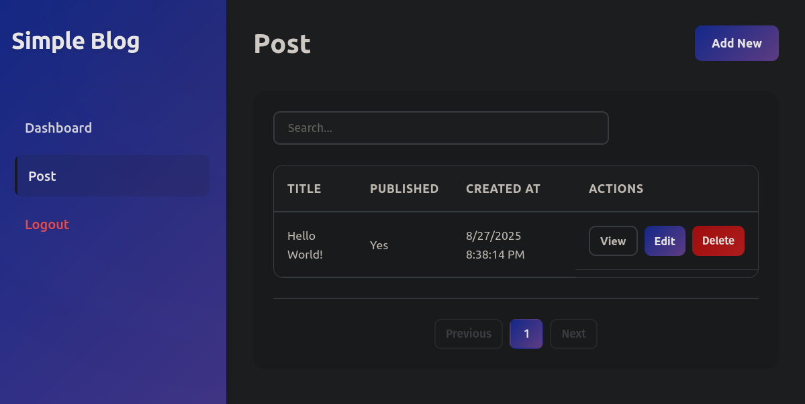

# yamlforge

yamlforge is a single-binary tool that generates and serves complete web applications from YAML configuration files. Define your data models, validation rules, and UI preferences in YAML, and yamlforge instantly creates a working application with both backend API and frontend interface.



## Features

- **Single YAML file**: Create functional web applications without writing code just a single YAML file
- **Single Binary**: No dependencies or runtime requirements
- **Instant Preview**: Live development server with hot reload
- **Auto-generated API**: RESTful endpoints with pagination, filtering, and sorting
- **Built-in UI**: Responsive web interface with list, form, and detail views
- **SQLite Support**: Embedded database with automatic schema generation
- **Validation**: Server-side validation with customizable rules
- **Field Types**: Support for text, number, boolean, email, datetime, enum, and more

## Quick Start

### Installation

```bash
go get github.com/yamlforge/yamlforge
go build -o yamlforge cmd/yamlforge/main.go
```

### Usage

1. Create a YAML configuration file:

```yaml
app:
  name: "My App"
  version: "1.0.0"

database:
  type: sqlite
  path: "./data.db"

models:
  Task:
    fields:
      id:
        type: id
        primary: true
      title:
        type: text
        required: true
      completed:
        type: boolean
        default: false
```

2. Start the development server:

```bash
./yamlforge serve myapp.yaml
```

3. Open your browser to `http://localhost:8080`

## Command Line Usage

```bash
# Start development server
yamlforge serve <config.yaml> [options]

# Validate configuration
yamlforge validate <config.yaml>

# Options
  -port int      Server port (default 8080)
  -host string   Server host (default "0.0.0.0")
```

## Configuration Reference

### App Configuration

```yaml
app:
  name: "Application Name"
  version: "1.0.0"
  description: "Application description"
```

### Database Configuration

```yaml
database:
  type: sqlite
  path: "./data.db"
```

### Server Configuration

```yaml
server:
  port: 8080
  host: "0.0.0.0"
  cors:
    enabled: true
    origins: ["*"]
  auth:
    type: jwt
    secret: "your-secret-key"
    expires: "24h"
```

### UI Configuration

```yaml
ui:
  theme: "light" # light | dark | auto
  title: "My App"
  logo: "./logo.png"
  layout: "sidebar" # sidebar | topbar
```

### Model Definition

```yaml
models:
  ModelName:
    fields:
      fieldName:
        type: text
        required: true
        # ... other validations

    ui:
      list:
        columns: ["field1", "field2"]
        sortable: ["field1"]
        searchable: ["field1"]
      form:
        fields: ["field1", "field2"]

    permissions:
      create: "authenticated"
      read: "all"
      update: "owner"
      delete: "admin"
```

## Field Types

### Basic Types

- `text`: String field with min/max length
- `number`: Integer with min/max value
- `boolean`: True/false checkbox
- `datetime`: Date and time picker
- `date`: Date only
- `time`: Time only

### Special Types

- `id`: Auto-generated unique identifier
- `email`: Email with validation
- `password`: Secure password field
- `enum`: Select from options
- `relation`: Foreign key reference
- `array`: List of items
- `markdown`: Rich text editor

### Validations

- `required`: Field must have a value
- `unique`: Value must be unique
- `min`/`max`: Length or value limits
- `pattern`: Regex validation
- `default`: Default value

## API Endpoints

For each model, the following endpoints are automatically generated:

- `GET /api/{model}` - List with pagination
- `GET /api/{model}/{id}` - Get single record
- `POST /api/{model}` - Create new record
- `PUT /api/{model}/{id}` - Update record
- `DELETE /api/{model}/{id}` - Delete record
- `POST /api/{model}/bulk` - Bulk operations

### Query Parameters

- `page`: Page number (default: 1)
- `page_size`: Items per page (default: 20)
- `sort`: Sort fields (prefix with `-` for DESC)
- `search`: Search in searchable fields
- `filter.{field}`: Filter by field value

Example: `/api/tasks?page=2&sort=-created_at&filter.status=todo`

## Examples

See the `examples/` directory for complete examples:

- `blog.yaml` - Simple blog application
- `tasks.yaml` - Task management system
- `users.yaml` - User management with relationships

## Development

### Project Structure

```
yamlforge/
├── cmd/yamlforge/      # Main entry point
├── internal/
│   ├── parser/         # YAML parsing
│   ├── database/       # Database layer
│   ├── api/           # API handlers
│   ├── server/        # HTTP server
│   ├── ui/            # Frontend assets
│   └── validation/    # Validation logic
└── examples/          # Example configurations
```

### Building from Source

```bash
# Install dependencies
go mod download

# Build binary
go build -o yamlforge cmd/yamlforge/main.go

# Run tests
go test ./...
```

## License

MIT License - see LICENSE file for details
